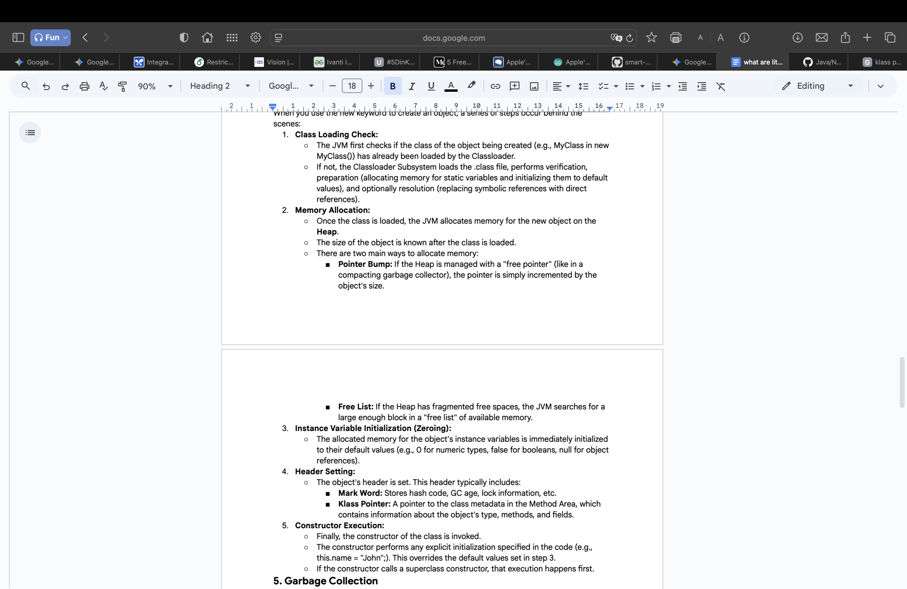

*Topics --> Classes and Objects, ...*

- *Class* --> is a blueprint, defines the structure (data/fields) and behavior (methods) that objects of that type will posses. its a logical construct.
- *Object* --> is a concrete instance of a class.

---

- ***Class***
  - it is a user-defined data type, that acts as a template for creating objects.
  - *Components*,
    - Fields
    - Methods
    - Constructors
    - Blocks 
      - Instance Initialization blocks -->  Code blocks executed every time an object is created, before the constructor.
      - Static Initialization blocks --> Code blocks executed once when the class is loaded into the JVM.
    - Nested Classes/Interfaces

- ***Object***
  - An object is a runtime entity that has state (Values), behavior(Methods), and identity(Memory address). It's a concrete manifestation of a class.
  - *Object Creation Process (`new` keyword)*,
    - Objects are created using the new keyword, which allocates memory on the Heap for the new object.
    - *Steps*
      - Declaration --> declares a refernce variable on the Stack (only if a variable is being declared to store the object reference)
      - Instantiation --> (Memory Allocation) this includes space for all instance variables (initialized to their default values) and **Object Overhead**
      - Contructor Invocation --> after memory allocation, suitable constructor is invoked.
      - Reference Assignment --> The memory address of the newly created object on the Heap is returned and this address to assigned to the reference variable.

***Order of Execution when an object is Created**
- first of all all the static initializers and variables are initialized when the class is loaded into the memory (they are executed only once when the class is loaded into memory, no matter how many objects we create).

- then the instance variables are initialized and instance initialization blocks are executed in the order they appear.

- Next the Constructors are invoked.

**Constructors**
- usually used to initialize the state(instance variables) of the new object
  - Name is same as class name
  - No return type (not even `void`)
  - can only be invoked implicitly (with `new` keyword)

- Types,
  - Default Constructor
  - No-Argument User-defined Constructor
  - Parameterized Constructor

- Constructors can be overloaded, with each having unique parameter list (different number, type, order of parameters)

**Constructor Chaining (`this()` & `super()`)**
- `this()`
  - used to call another constructor within the same class
  - it must be the first statement in the constructor

- `super()`
  - used to call the constructor of a super class
  - it must be the first statement of the constructor
  - if not explicitly called, java implicitly calls the no parameter `super()` constructor.

- we cannot use `this()` and `super()` within a same constructor.

  ***Order of Execution***
  - lets say we have a Parent class and a child class each having a constructor, a static initializer, an instance initializer.
  
  - the Order of execution will be 

    `
    Parent Static Initializer
    Child Static Initializer
    Parent Instance Initializer
    Patent Constructor
    Child Instance Initializer
    Child Constructor`
    
  - This means first parent and then the child classes are loaded into memory, then the parent is Initialized and then the child is Initialized.

- `this` keyword
  - it is a reference variable that refers to the current object.
  - to refer current object instance members --> `this.memberName` / `this.memberName()`
  - to invoke current class constructors --> `this(args)`
  - to return current class instance --> `return this;`

- `static` keyword
  - it makes a member belong to a class itself
  - *static variables* --> stored in method area, shared by all objects of the class.
  - *static methods* --> they dont have this reference.

## Encapsulation
-  It refers to the bundling of data (fields) and the methods that operate on that data within a single unit (the class).
- provides, data hiding (private members) and controlled access (through methods like getters and setters).

## Access Modifiers
- private --> within class
- default --> package-private
- protected --> within same package and subclass (even of different package)
- public --> accessible from anywhere

