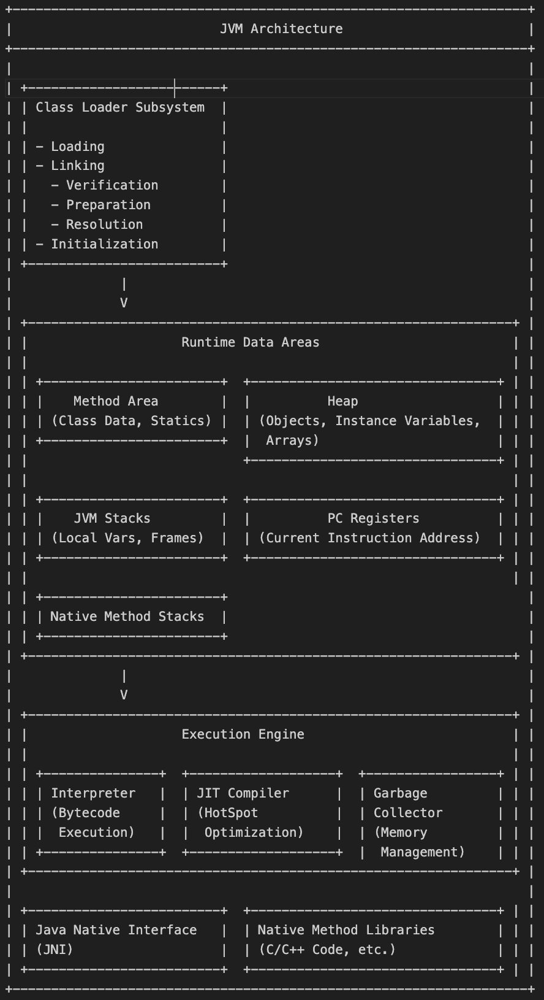

> *Topics: JDK, JRE, JVM, Class Loader, Garbage Collection, . . .*\
> *Link to Codes --> [Codes](../codes/Classes&Objects/Creation.java)*

## Java Development Kit (JDK): The Complete Development Suite

- **JDK = JRE + Development Tools.**
- The JDK is a superset of the JRE. It includes everything in the JRE, plus a comprehensive set of tools for developing, compiling, debugging, and packaging Java applications.
- Key Development Tools in JDK:
  - `javac` --> The Java compiler (converts .java source code to .class bytecode).
  - `java` --> The Java application launcher (invokes the JVM to run .class files).
  - `jdb` --> The Java debugger.
  - `javadoc` --> The documentation generator.
  - `jar` --> The Java archive tool (for creating JAR files).
  - And many more utilities.

---

##  Java Runtime Environment (JRE): The Execution Package

- **JRE = JVM + Java Class Libraries + Supporting Files.**
- a software package that provides the minimum requirements for executing a Java application.
- Components of JRE,
  - **Java Virtual Machine (JVM)** --> responsible for interpreting and executing Java bytecode. (JRE provides a concrete implementation of the JVM specification.)

  - **Java Class Libraries (or Java API)** --> a vast collection of pre-written code (classes and interfaces).these libraries provide functionalities like,
    - `java.lang` --> Core language classes (e.g., `Object`, `String`, `System`).
    - `java.util` --> Utility classes (e.g., `ArrayList`, `HashMap`, `Date`).
    - `java.io` --> Input/Output operations.
    - `java.net` --> Networking.
    - `java.awt` and `javax.swing` --> Graphical User Interface (GUI) toolkits.
    - `java.sql` --> JDBC (Java Database Connectivity) API.
    - ...

  - **Supporting Files** --> Other files necessary for the JVM and libraries to function correctly, such as configuration files, property files, and sometimes native libraries.

- **How JRE Relates to JVM ?**
  - The **JVM is an abstract specification** (a set of rules and requirements for how a virtual machine should behave), it specifies,
    - Instruction Set
    - Memory Areas
    - Class File Format
    - Garbage Collection
    - Runtime Data Areas
    - Instruction Execution

    - it ensures **Platform Independence** of Java bytecode (*"Write Once, Run Anywhere" (WORA) paradigm*)

  - The **JRE is a concrete implementation** of that JVM specification, bundled with all the necessary libraries and files that a Java program needs to run, it bundles,
    - An implementation of JVM
    - Java Class Libraries
    - Supporting Files

    - usually there are different JREs(JREs are platform dependent meaning there are different versions of JREs for different OS because the JRE includes native code components and it needs to interact directly with the hardware) but they adhere to the standard JVM specification making Java bytecode Platform Independent.

- ***The complete hierarchy is: JDK > JRE > JVM***

---

## JVM

-  It's an abstract machine that provides a runtime environment in which Java bytecode can be executed.
- The JVM is responsible for loading, verifying, executing Java bytecode, and managing memory.
- It makes Java a "write once, run anywhere" language by abstracting the underlying operating system and hardware.

### JVM Architecture Overview
- can be braodly divided into subsystems,
  - *Class Loader Subsystem*
  - *Runtime Data Areas*
  - *Execution Engine*
  - *Java Native Interface*
  - *Native Method Libraries*

---

- ***Class Loader Subsystem***, *(The Gatekeeper of Classes)*
  - responsible for loading `.class` files from the file system, network, or other sources into the JVM's memory.
  - It performs 3 main functions : `Loading`, `Linking`, `Initialization`
  
  - ***Phases of Class Loading***
    - **Loading**
      - finds `.class` for a given class name
      - it reads the binary data from `.class` file
      - It creates a `java.lang.Class` object in the Method Area for that class. This Class object contains all the metadata about the class (fields, methods, constructors, interfaces, superclass, etc.).
      (this is something related to "Klass Pointer", explore a bit)
      - For each loaded class, the JVM stores its fully qualified name, its superclass's fully qualified name, and whether it's a class, interface, or enum.

    - **Linking** (has 3 sub-steps)
      - *Verification* -->  The bytecode verifier checks the loaded bytecode to ensure it adheres to the JVM specification and does not pose any security threats (e.g., ensuring type safety, correct operand stack manipulation, proper access to private members). 
        - If verification fails, a `VerifyError` is thrown.
    
      - *Preparation* --> The JVM allocates memory for static variables (class variables) in the Method Area and initializes them to their default values.
        - It does not execute any code or assign explicit initial values defined in the source code at this stage.

      - *Resolution* --> This is the process of replacing symbolic references (e.g., references to other classes, methods, or fields by their names) with direct references (memory addresses) from the Runtime Constant Pool.
        -  This step is often performed lazily, meaning it happens only when a symbolic reference is actually used for the first time.

    - **Initialization**
        - It's when the static initializers and static blocks of the class are executed.
        - Static variables are assigned their actual values as defined in the source code.
        - Initialization occurs only once per class.
        - The JVM ensures that a class is initialized only after its direct superclass has been initialized.

  - **Class Loader Delegation Heirarchy**
  - Java employs a delegation model for class loading, which ensures security and prevents malicious code from replacing core Java classes. 
  - There are three built-in class loaders:
    1. **Bootstrap Class Loader (Primordial Class Loader)**
        - Loads core Java API classes (e.g., `java.lang.*`, `java.util.*`) from the `rt.jar` (runtime library) and other core library JARs in the `<JAVA_HOME>/jre/lib` directory.
        - It's implemented in native code (C/C++) and doesn't have a parent.
        - *Parent* : `null` (It's implemented in native code and doesn't have a parent.)

    2. **Extension Class Loader**
        - Loads classes from the extension directories, typically `<JAVA_HOME>/jre/lib/ext` or any directory specified by the `java.ext.dirs` system property.
        - These are extensions to the standard Java platform.
        - *Parent* : Bootstrap Class Loader
    
    3. **Application Class Loader (System Class Loader)**
        - Loads application-specific classes from the classpath (specified by the `CLASSPATH` environment variable, `-classpath` or `-cp` command-line options).
        - This is the class loader that typically loads your application's classes.
        - *Parent* : Extension Class Loader.

    - **Delegation Principle** --> When a Class Loader is asked to load a class, it first delegates the request to its parent. Only if the parent cannot find or load the class does the current Class Loader attempt to load it itself. This ensures that core Java classes are always loaded by the Bootstrap Class Loader, preventing them from being overridden. 
      - Bootstrap -> Extension -> application
      - (If none of the classloaders can find the class, a `ClassNotFoundException` is thrown.)

---

- ***JVM Memory Areas (Runtime Data Areas)***
  - *In another file --> Link: [Memory Allocation](Memory_Allocation.md)*

---

- ***Object Creation Process*** *(When the `new` keyword is used)*
  - **Class Loading Check**
    - checks if the class of the object being created has already been loaded by the ClassLoader
    - if not, the classloader subsystem will load the `.class` file, performs verification, preparation (memory allocation and initialization of static variables), and optionally resolution (replacing symbolic references with direct references)

  - **Memory Allocation**
    - once class is loaded, JVM allocates memory for new object on Heap.
    - size of the object is known after the class is loaded
    - there are 2 ways of allocating memory,
      - *Pointer Bump* --> if the heap is managed by a `free pointer` (like in Compacting Garbage collector), the pointer is simply incremented by object size.
      - *Free List* --> if the heap has fragmented free spaces, JVM searches for large enough block in a `free list` of available memory.

  - **Instance Variable Initialization (Zeroing)**
    - the allocated memory for the object's instance variables is initialized to default values.

  - **Header Setting**
    - the object's header is set.
    - the header typically includes,
      - *Mark Word* --> Stores hash code, GC age, lock information, ...
      - *Klass Pointer* --> a pointer to the class metadata in the Method area, which contains information about the object's type, methods, fields.

  - **Constructor Execution**
    - constructor of the class is invoked

---

- ***Execution Engine*** (Brings Bytecode to Life)
  - responsible for executing the bytecode that has been loaded and linked by the Class Loader.
  - it consists of,
    1. **Interpreter**
       - reads and executes bytecode instructions one by one
       - It's relatively slow because it interprets each instruction every time it's encountered. (Good for code that is executed only few times)

    2. **JIT (Just-In-Time) Compiler** (modern JVMs like HotSpot uses this)
        - It identifies "hot spots" (frequently executed code paths, like loops or frequently called methods)
        - It compiles these bytecode sequences into highly optimized native machine code during runtime.
        - Once compiled, the native code is stored in the code cache and can be executed directly by the CPU, bypassing the interpreter for subsequent calls. This significantly speeds up execution.
        - The JIT compiler also performs various optimizations (e.g., inlining, dead code elimination).

    3. **Garbage Collector (GC)**
       - Automatic Memory Management on the Heap.

---

### Garbage Collection (GC): Automatic Memory Management

- The Garbage Collector is a daemon thread that automatically manages memory on the Heap.
- frees up memory occupied by objects that are no longer "reachable" or "live" (i.e., no longer referenced by any active part of the program).
- Avoids Memory Leaks, Dangling Pointers (references to memory that has already been freed), provides simplicity

- ***How GC Identifies Garbage? : Reachability***
  - The GC determines if an object is "live" or "dead" based on reachability.
  - An object is considered reachable if it can be accessed directly or indirectly from a set of **GC Roots**.

  - **GC Roots** include,
    - Local variables and parameters in the currently executing methods on the Stack.
    - Static variables (class variables) in the Method Area.
    - References from JNI (Java Native Interface) code.
    - Threads that are currently running.

- If an object is not reachable from any GC Root, it is considered garbage and eligible for collection.

- ***Garbage Collection Algorithms***
  - **Mark and Sweep**
    - *Mark Phase* --> The GC traverses the object graph starting from GC Roots, marking all reachable objects as `live`.
    - *Sweep Phase* --> The GC then iterates through the entire Heap, reclaiming memory from all unmarked (unreachable) objects.
    - *Problem* --> this leads to fragmentation (free memory is scattered in small, non-contiguous blocks)

  - **Copying**
    - divides Heap into two equal  (semi spaces).
    - During collection, it copies all live objects from the `from` space to the `to` space.
    - After copying, the `from` space is completely cleared.
    - eliminates fragmentation but needs twice the memory (half is almost always empty)

  - **Mark and Compact (Mark-Sweep-Compact)**
    - *Mark Phase* --> identifies `live` objects.
    - *Compaction Phase* --> Moves all live objects to one end of the Heap, compacting the free space into a single contiguous block.
    - *Advantage* --> provides address fragmentation
    - but can be slower due to object Movement

  - **Generational Garbage Collection**
    - most of JVMs (like hotsopt) use this.
    - it is based on `Generational Hypothesis`
    - **Generational Hypothesis**
      - *Most Objects are Short-Lived* --> Many objects are created, used briefly, and then become garbage (e.g., local variables, temporary objects).
      - *Few objects are long-lived* --> A small percentage of objects survive for a long time (e.g., application configuration, long-lived data structures).
    
    - to optimize GC, heap is divided into generations,
      - **Young Generation**
        - where new objects are initially allocated
        - Typically divided into,
          - ***Eden Space*** --> Most new objects are created here
          - ***Survivor Spaces (S0 and S1)*** --> Objects that survive a minor GC in Eden are moved between these two spaces.

        - ***Minor GC (Young GC)*** --> Occurs frequently. its efficient, it primarilly uses a copying algorithm and most objects in the Young Generation are expected to be Garbage.

      - **Old Generation (Tenured Generation)**
        - Objects that survive multiple Minor GCs (i.e., they are long-lived) are "promoted" or "tenured" to the Old Generation.

        - ***Major GC (Full GC)*** --> less frequent than Minor GC.
          - It cleans up the entire Heap (both Young and Old Generations). It's typically more expensive and can cause longer "Stop-The-World" (STW) pauses (where application threads are halted).

- ***Common Garbage Collectors***
  - `Serial GC`: Simple, single-threaded. Suitable for small applications.

  - `Parallel GC (Throughput Collector)`: Multi-threaded Minor and Major GC. Designed for high throughput, but can have longer STW pauses.

  - `CMS (Concurrent Mark Sweep) GC`: Aims to reduce STW pauses by performing most of its work concurrently with application threads. Deprecated in newer Java versions.

  - `G1 (Garbage-First) GC`: A region-based, concurrent, and parallel collector designed for large heaps and multi-core processors. Aims to meet user-defined pause time goals. Default in recent Java versions.

  - `ZGC / Shenandoah`: Low-latency, highly concurrent collectors designed for very large heaps (terabytes) with extremely short STW pauses.

  (Try to elaborate these Garabage Collectors)

## Destroying Objects

### Garbage Collection (GC)
Garbage Collection is the automatic process of freeing up memory on the heap by deleting objects that are no longer "reachable."

* **What does "no longer reachable" mean?**
    * The object has no active references pointing to it.
    * All references to the object have gone out of scope (e.g., the method they were declared in has finished executing).
* `static` objects are generally not eligible for garbage collection because they are tied to the class and exist for the program's entire lifecycle.

* **`System.gc()`**
    * This method **suggests** to the Java Virtual Machine (JVM) that now might be a good time to run the garbage collector.
    * It does **not guarantee** that the GC will run. The JVM is free to ignore this request.

* **Finalization (`finalize()` method)**
    - The `Object` class has a `protected void finalize()` method.
    * A method from the `Object` class that *might* be invoked by the garbage collector just before an object is destroyed, giving the object a chance to perform cleanup operations .
    * It was intended for releasing non-Java resources (like file handles or database connections).
    * Its execution is **unpredictable** (it might not run at all) and it has been **deprecated** in modern Java.
    - *Allegations against `finalize()`*
      - **Non-deterministic** --> no gurantee that it will be invoked.
      - **Performance Overhead** --> add overhead and delay garbage collection.
      - **Resurrection** --> An object can "resurrect" itself from garbage by making itself reachable again within`finalize()`, leading to complex scenarios.

    - *Alternatives* --> `try-with-resources`

***JVM Memory Management (Summary)***
- *Class Loading* --> classes are loaded into method area (Static variables and bytecode reside here).

- *Object Creation* --> `new` allocates Objects on Heap. Instance variables are part of Objects.

- *Method Execution* --> each thread gets a stack for its method calls. Local variables and parameters live here. References on Stack (and method area) point to objects on Heap.

- *Garbage COllection* --> monitors Heap, identifies and reclaims memory from unreachable objects.

---

### Java Code Compilation Process

- uses `javac`
  - Parsing
  - Semantic Analysis
  - Bytecode Generation
  - creates `.class` file

- Intermediate code form is called the `bytecode` because, each instruction is typically represented by a single `byte`.
