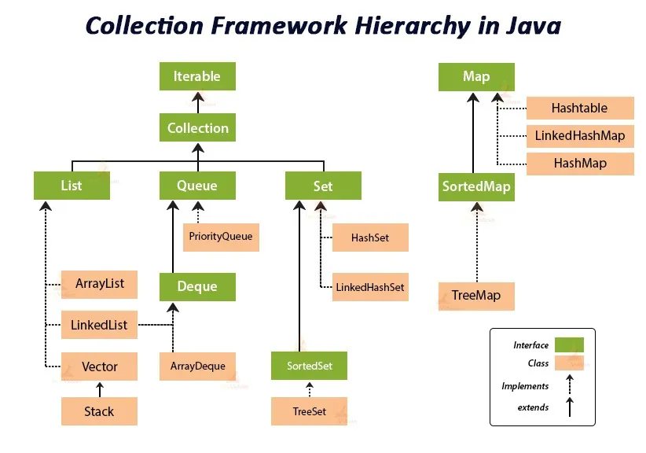

*Topics --> Collection Framework, . . .*

## Collection Framework
- A set of interfaces and classes that implement commonly reusable collection data structures.
- Prior to Java 2 (JDK 1.2), Java had ad-hoc classes for grouping objects (like `Vector`, `Hashtable`, `Array`). The Collections Framework, introduced in Java 1.2, standardized this approach.

### `Collection<E>` Interface (The Root Interface)
- The most general interface in the collection hierarchy. It represents a group of objects, known as its elements.
- *Characteristics*,
  - does not guarantee order
  - May or may not allow duplicate elements (depends on implementing sub-interfaces/classes).

- *Methods* --> `boolean add(E e)`, `boolean remove(Object o)`, `boolean contains(Object o)`, `int size()`, `boolean isEmpty()`, `Iterator<E> iterator()`, `void clear()`, `boolean addAll(Collection<? extends E> c)`, `boolean removeAll(Collection<?> c)`, `boolean retainAll(Collection<?> c)`, . . .

---

### `List<E>` Interface (Ordered Collection, Allows Duplicates)
-  Represents an ordered collection (sequence) of elements. Elements can be accessed by their integer index.
- *Characteristics*,
  - Ordered
  - Allows duplictes
  - Indexed access

- *Methods* --> (all methods of `Collection`), `void add(int index, E element)`, `E get(int index)`, `E set(int index, E element)`, `E remove(int index)`, `int indexOf(Object o)`, `int lastIndexOf(Object o)`, `ListIterator<E> listIterator()`, . . .

***`List` Implementations***

- **`ArrayList<E>`**
  - *Underlying Data Structure* --> Resizable Array
  - *Performance*
    - `get(index)` --> O(1) - direct array access
    - `add(element)` (at end) --> Amortized O(1) - usually fast, but can be O(N) if resizing is needed.
    - `add(index, element)` / `remove(index)` --> O(N) - requires shifting elements.
    - `remove(Object)` --> O(N) - requires searching and shifting.
  - Non-Synchronized --> Not Thread Safe

- **`LinkedList<E>`**
  - *Underlying Data Structure* --> Doubly-linked list.
  - *Performance*,
    - `get(index)` --> O(N) - requires traversing the list.
    - `addFirst() / addLast() / removeFirst() / removeLast()` --> O(1) - constant time.
    - `add(index, element) / remove(index) (in middle)` --> O(N) - requires traversal to find the position, but once found, insertion/deletion is O(1).

  - Non-Synchronized --> Not Thread Safe

- **`Vector<E>` (Legacy)**
  - *Underlying Data Structure* --> Resizable array.
  - *Performance* --> similar to `ArrayList`, but generally slower due to synchronization overhead
  - Synchronized --> all methods are Synchronized (thread safe)

---

### `Set<E>` Interface (Unordered Collection, No Duplicates)
- Represents a collection that contains no duplicate elements. It models the mathematical set abstraction.
- *Characteristics*
  - No duplicates
  - Unordered (generally) --> Most `Set` implementations do not guarantee any order of elements.

- *Methods* --> (all Inherited), `boolean add(E e)`, `boolean remove(Object o)`, . . .

***`Set` Implementations***

- **`HashSet<E>`**
  - *Underlying Data Structure* --> Hash table (backed by a `HashMap`).
  - *Performance*,
    - `add()` / `remove()` / `contains()` --> O(1) on average (constant time), assuming a good hash function and minimal collisions. Can degrade to O(N) in worst-case collision scenarios.

  - *Characteristics*
    - does not guarantee insertion order
    - elements are stored based on their `hashCode()` and `equals()` methods.

  - Non-Synchronized --> Not Thread Safe

- **`LinkedHashSet<E>`**
  - *Underlying Data Structure* --> Hash table with a doubly-linked list running through its entries.
  - *Performance* --> Similar to HashSet (O(1) average for basic operations).
  - *Characteristics* --> Maintains insertion order (the order in which elements were added).
  - Non-Synchronized --> Not Thread Safe

- **`TreeSet<E>`**
  - *Underlying Data Structure* --> Red-Black Tree (a self-balancing binary search tree).
  - *Performance* --> 
    - `add()` / `remove()` / `contains()` --> O(log N) (logarithmic time).

  - *Characteristics*,
    - Stores elements in sorted (natural or custom comparator) order. 
    - Does not allow null elements (throws NullPointerException if you try to add one).

  - Non-Synchronized --> Not Thread Safe

---

### `Queue<E>` Interface (FIFO Collection)
- Represents a collection designed for holding elements prior to processing. Typically, elements are added at one end and removed from the other (FIFO - First-In, First-Out).
- *Characteristics*,
  - FIFO
  - does not support indexed access

- *Methods* --> `boolean add(E e)` / `boolean offer(E e)`, `E remove()` / `E poll()`, `E element()` / `E peek()`, . . .

### `Deque<E>` Interface (Double-Ended Queue)
- Represents a double-ended queue, which supports element insertion and removal at both ends.
- it extends `Queue`
- *Characteristics* --> Can be used as a FIFO queue or a LIFO (Last-In, First-Out) stack.

- *Methods* --> `void addFirst(E e)`, `void addLast(E e)`, `E removeFirst()`, `E removeLast()`, `E peekFirst()`, `E peekLast()`, `push()`, `pop()`, . . .

***`Queue` and `Deque` Implementations***

- **`PriorityQueue<E>`**
  - *Underlying Data Structure* --> Min-heap (a binary heap).
  - *Characteristics*
    - Elements are ordered according to their natural ordering or by a Comparator provided at queue construction time. 
    - The head of the queue is the least element. 
    - Not strictly FIFO.

  - *Performance*
    - `offer()`, `poll()`, `peek()` : O(log N).
  
  - Non-Synchronized --> Not Thread Safe

- **`ArrayDeque<E>`**
  - *Underlying Data Structure* --> Resizable array.
  - *Characteristics*
    - Can function as both a Queue (FIFO) and a Deque (double-ended queue/stack). 
    - More efficient than LinkedList when used as a stack or queue.
  
  - *Performance*
    - `addFirst()`, `addLast()`, `removeFirst()`, `removeLast()` : amortized O(1).

  - Non-Synchronized --> Not Thread Safe

---

### `Map<K, V>` (Key-Value Pair Collection)
- Represents a collection that maps unique keys to values. It's not a true `Collection` (doesn't implement `Collection` interface directly) but is part of the framework.
- *Characteristics*,
  - Uniques Keys
  - Allows duplicate values
  - No Order (generally)

- *Methods* --> `V put(K key, V value)`, `V get(Object key)`, `V remove(Object key)`, `boolean containsKey(Object key)`, `boolean containsValue(Object value)`, `Set<K> keySet()`, `Collection<V> values()`, `Set<Map.Entry<K, V>> entrySet()`, . . .

***`Map` Implementations***

- **`HashMap<K, V>`**
  - *Underlying Data Structure* --> Hash table.
  - *Performance*,
    - `put()` / `get()` / `remove()` / `containsKey()` --> O(1) on average, assuming a good hash function and minimal collisions. Can degrade to O(N) in worst-case collision scenarios.

  - *Characteristics*,
    - Does not Guarantee Insertion Order.
    - Allows one `null` key and multiple `null` values.

  - Non-Synchronized --> Not Thread Safe

-**`LinkedHashMap<K, V>`**
  - *Underlying Data Structure* --> Hash table with a doubly-linked list running through its entries.
  - *Performance* --> Similar to `HashMap` (O(1) average for basic operations).

  - *Characteristics*
    - Maintains Insertion order
    - can be configured to maintain access order (useful for LRU caches)

  - Non-Synchronized --> Not Thread Safe

- **`TreeMap<K, V>`**
  - *Underlying Data Structure* --> Red-Black Tree.
  - *Performance*
    - `put()` / `get()` / `remove()` / `containsKey()`: O(log N).

  - *Characteristics*
    - Stores entries in sorted order based on the natural order of keys or a custom Comparator. 
    - Does not allow null keys.

  - Non-Synchronized --> Not Thread Safe

- **`Hashtable<K, V>` (Legacy)**
  - *Underlying Data Structure* --> Hash table.
  - *Performance* --> Similar to `HashMap`, but generally slower due to synchronization overhead.
  - Synchronized --> all methods are synchronized (thread safe)
  - *Characteristics*
    - does not allow `null` values or `null` keys

### Utility Classes: `Collections` and `Arrays`

- The Java Collections Framework provides utility classes with static methods to perform common operations on collections and arrays.

***`java.util.Collections`***
- Provides static methods that operate on or return collections.
- It contains polymorphic algorithms that operate on collections, "wrappers", which return a new collection backed by a specified collection, and a few other odds and ends.

- *Key Methods*
  - **Sorting**
  - **Searcing**
  - **Shuffling**
  - **Reversing**
  - **Frequency/Disjoint**
  - **Thread-Safe Wrappers**

***`java.util.Arrays`***
- Provides static methods to manipulate arrays.

- *Key Methods*
  - `sort(array)` --> Sorts an array.
  - `binarySearch(array, key)` --> searches for an element
  - `copyOf(original, newLength)` --> Copies an array.
  - `asList(T... a)` --> Returns a fixed-size List backed by the specified array. (Modifying this list directly modifies the array).
  - `deepEquals(Object[] a1, Object[] a2)` --> Compares two arrays for deep equality.